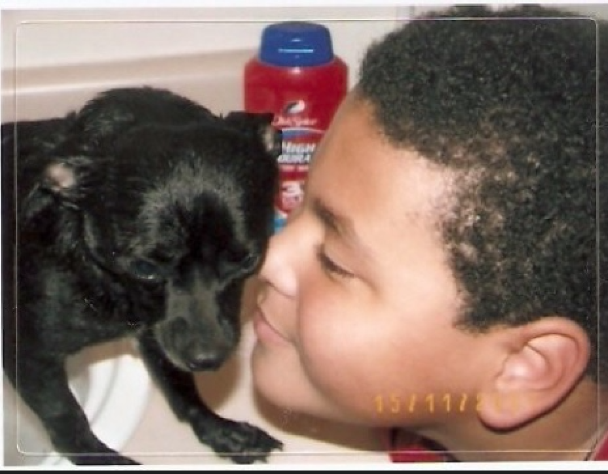

# RWBootcamp

Second Weeks HW! 

**For this weeks homework. I chose to use a class for both of my models.
I chose to use a class because I needed to have values change within the game,
the score and points of the game are examples. **

My name is Jaron and I'm still getting the hang of programming let alone Git lol

My Discord name is JaySchwifty! Come and say hello!

I live in the USA in Elyria, OH

My programming experince is less than a year. I've been on & off again for a while now. I'm finally ready to buckle down and learn what I need to in order to get a job and start creating all those million dollar app ideas I've been thinking about lol

My goals consist of getting out of the situation I'm currently in pertaining to my job as well as set myself up to start my own business.

Some of my hobbies are Singing, playing video games (I'm trash at COD Warzone lol), learning to become a developer and spending time with my family and pups.

